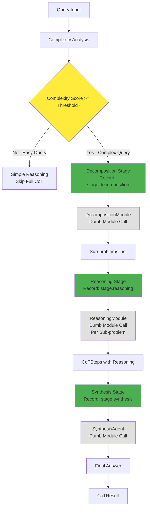

# CoT Layered Reasoning Stages Integration

## PHASE 1 — Research Summary

The IBM CoT framework specifies **layered reasoning stages**:

1. **Decomposition**: Break complex problems into manageable sub-problems
2. **Reasoning**: Execute step-by-step reasoning on decomposed problems
3. **Synthesis**: Combine reasoning results into a coherent final answer

This differs from the current implementation which has implicit stages but lacks explicit orchestration boundaries.

## PHASE 2 — Codebase Mapping

### Framework Component → Existing Module(s)

| Framework Component | Existing Module | Status |

|---------------------|----------------|--------|

| **Decomposition Stage** | `decomposition.py` (DecompositionModule) | ✅ Exists, not integrated |

| **Reasoning Stage** | `reasoning.py` (ReasoningModule) | ✅ Exists, not integrated |

| **Synthesis Stage** | `synthesis_agent.py` (SynthesisAgent) | ✅ Exists, but focused on document synthesis |

| **CoT Orchestration** | `chain_of_thought.py` (ChainOfThought) | ✅ Exists, implicit stages |

### Missing Components

- Explicit stage orchestration (decomposition → reasoning → synthesis)
- Integration hooks between CoT and existing stage modules
- CoT-specific synthesis (adapting synthesis_agent for reasoning synthesis)

### Overlap Analysis

- Current CoT has implicit decomposition (line 167-178: creates steps)
- Current CoT has implicit reasoning (line 189-239: executes steps)
- Current CoT has basic synthesis (line 245-247: synthesizes answer)
- **Gap**: No explicit stage boundaries or module integration

### Conflicts

- None identified. Modules are independent and can be integrated.

## PHASE 3 — Classification: **Category B (Partially Implemented)**

The framework exists but lacks:

- Explicit layered stage orchestration
- Integration with existing decomposition/reasoning modules
- Enhanced synthesis for reasoning (not just documents)

## PHASE 4 — Patch Plan

### Files to Modify

1. **[mavaia_core/brain/modules/chain_of_thought.py](mavaia_core/brain/modules/chain_of_thought.py)**

   - **Add**: Stage orchestration methods (`_decomposition_stage`, `_reasoning_stage`, `_synthesis_stage`)
   - **Modify**: `_execute_cot` to use explicit stage flow
   - **Add**: Integration with DecompositionModule, ReasoningModule
   - **Enhance**: Synthesis to leverage SynthesisAgent for reasoning synthesis
   - **Preserve**: All existing operations and backward compatibility

2. **[mavaia_core/brain/modules/cot_models.py](mavaia_core/brain/modules/cot_models.py)**

   - **Add**: `CoTStageResult` dataclass to track stage outputs
   - **Add**: Stage metadata to `CoTConfiguration` (optional stage enablement)

### New Methods to Add (chain_of_thought.py)

```python
def _decomposition_stage(self, query: str, context: str, config: CoTConfiguration) -> dict[str, Any]
    """Explicit decomposition stage - leverages DecompositionModule (dumb module, orchestrated here)
    
    Records metrics: operation="stage.decomposition", module_name="chain_of_thought"
    Returns: dict with "sub_problems" (list[str]) and "decomposition_result" (dict)
    """
    
def _reasoning_stage(self, decomposed_problems: list[str], context: str, config: CoTConfiguration) -> list[CoTStep]
    """Explicit reasoning stage - leverages ReasoningModule (dumb module, orchestrated here)
    
    Records metrics: operation="stage.reasoning", module_name="chain_of_thought"
    Returns: list[CoTStep] with reasoning results for each sub-problem
    """
    
def _synthesis_stage(self, query: str, reasoning_steps: list[CoTStep], decomposed_problems: list[str], config: CoTConfiguration) -> str
    """Explicit synthesis stage - leverages SynthesisAgent (dumb module, orchestrated here)
    
    Records metrics: operation="stage.synthesis", module_name="chain_of_thought"
    Returns: str final answer synthesized from reasoning steps
    """
```

### Stage-Level Metrics Collection

Each stage method will record metrics using the existing metrics system:

```python
from mavaia_core.brain.metrics import record_operation

# In each stage method:
start_time = time.time()
try:
    # Stage execution...
    record_operation(
        module_name="chain_of_thought",
        operation=f"stage.{stage_name}",  # e.g., "stage.decomposition"
        execution_time=time.time() - start_time,
        success=True,
        error=None
    )
except Exception as e:
    record_operation(
        module_name="chain_of_thought",
        operation=f"stage.{stage_name}",
        execution_time=time.time() - start_time,
        success=False,
        error=str(e)
    )
    raise
```

**Metrics tracked per stage**:

- `stage.decomposition` - Decomposition stage execution
- `stage.reasoning` - Reasoning stage execution  
- `stage.synthesis` - Synthesis stage execution
- Each includes: execution_time, success, error (if any)

### Architecture Principle: Orchestrator Pattern

**CRITICAL**: Keep stage modules **dumb** and `chain_of_thought.py` as the **smart orchestrator**.

#### Orchestrator Responsibilities (chain_of_thought.py)

The orchestrator is responsible for **ALL** decision-making and coordination:

1. **Complexity Gating**: Decides whether to run full CoT or use simple reasoning
2. **Stage Sequencing**: Determines order and dependencies of stages
3. **Context Management**: Passes context between stages, accumulates results
4. **Metrics Collection**: Records metrics for each stage execution
5. **Error Handling**: Manages fallbacks, graceful degradation
6. **Result Assembly**: Combines stage outputs into final CoTResult
7. **Module Coordination**: Calls stage modules at appropriate times

#### Stage Module Responsibilities (DecompositionModule, ReasoningModule, SynthesisAgent)

Stage modules are **dumb** - they only perform their single operation:

1. **Single Operation**: Execute one specific task when called
2. **No Orchestration**: Don't know about other stages or overall flow
3. **No Decisions**: Don't decide when/how to run (orchestrator decides)
4. **No Metrics**: Don't record metrics (orchestrator records)
5. **No Context Management**: Just receive input, return output
6. **Stateless**: Can be called multiple times independently

#### Example: Decomposition Stage

**Orchestrator (chain_of_thought.py)**:

```python
def _decomposition_stage(self, query: str, context: str, config: CoTConfiguration):
    # Orchestrator: Records metrics start
    start_time = time.time()
    record_operation(module_name="chain_of_thought", operation="stage.decomposition", ...)
    
    # Orchestrator: Decides to call decomposition module
    result = self._decomposition_module.execute("decompose", {"query": query, "context": context})
    
    # Orchestrator: Extracts and transforms result
    sub_problems = self._extract_sub_problems(result)
    
    # Orchestrator: Records metrics end
    record_operation(module_name="chain_of_thought", operation="stage.decomposition", execution_time=..., success=True)
    
    return {"sub_problems": sub_problems, "decomposition_result": result}
```

**Stage Module (DecompositionModule)**:

```python
def execute(self, operation: str, params: Dict[str, Any]):
    # Dumb module: Just performs decomposition, returns result
    # No knowledge of CoT, stages, metrics, or orchestration
    query = params.get("query")
    context = params.get("context")
    return self._decompose_problem(query, context)  # Simple operation
```

### Complexity-Based Gating

**CRITICAL**: Don't run full CoT for easy queries. Use complexity analysis to gate stage execution.

**Gating Logic** (in `_execute_cot`, lines ~158-165):

1. **Complexity Analysis** (existing, line 159-161):

   - Call `_analyze_complexity_internal()` to get complexity score
   - Check `complexity_score["requires_cot"]` boolean
   - Check `complexity_score["score"] `against `config.min_complexity_score` (default 0.6)

2. **Gating Decision**:
   ```python
   if not complexity_score["requires_cot"] or complexity_score["score"] < config.min_complexity_score:
       # Skip full CoT pipeline - use simple reasoning
       return self._execute_simple_reasoning(query, combined_context)
   ```

3. **Stage Execution** (only if complexity threshold met):

   - Decomposition → Reasoning → Synthesis stages
   - Each stage can also have internal gating if needed

4. **Metrics for Gating**:

   - Record `operation="cot.gating"` with decision (skipped/executed)
   - Track complexity scores for analysis

**Benefits**:

- Faster response for simple queries
- Resource efficiency (don't waste compute on easy problems)
- Better user experience (immediate answers for straightforward questions)

### Integration Points

1. **Decomposition Integration** (lines ~167-178):

   - **Orchestrator calls**: `DecompositionModule.execute("decompose", {"query": query, "context": context})`
   - **Orchestrator extracts**: `reasoning_steps` from result
   - **Orchestrator converts**: Sub-problems to structured list
   - **Module stays dumb**: Just returns decomposition result, no orchestration logic

2. **Reasoning Integration** (lines ~189-239):

   - **Orchestrator iterates**: For each decomposed problem
   - **Orchestrator calls**: `ReasoningModule.execute("reason", {"query": sub_problem, "context": context, "reasoning_type": "analytical"})`
   - **Orchestrator builds**: CoTStep objects from reasoning results
   - **Orchestrator maintains**: Accumulated context between steps
   - **Module stays dumb**: Just performs reasoning, returns result

3. **Synthesis Integration** (lines ~245-247):

   - **Orchestrator adapts**: Convert reasoning steps to "document-like" format
   - **Orchestrator calls**: `SynthesisAgent.execute("synthesize_answer", {"documents": reasoning_docs, "query": query})`
   - **Orchestrator extracts**: Final answer from synthesis result
   - **Orchestrator falls back**: To `_synthesize_final_answer_internal` if synthesis_agent unavailable
   - **Module stays dumb**: Just synthesizes, doesn't know about CoT context

### Backward Compatibility

- All existing operations remain unchanged
- Existing `execute_cot` behavior preserved (with enhanced stages)
- Configuration defaults maintain current behavior
- Optional stage enablement via config (can disable stages if needed)

### Minimal Diffs Strategy

- **Extend** `_execute_cot` with stage orchestration wrapper
- **Add** new stage methods without removing existing logic
- **Integrate** existing modules via lazy loading (same pattern as complexity_detector)
- **Preserve** all existing fallback mechanisms

## Implementation Details

### Stage Flow Architecture



### Key Changes

1. **Decomposition Stage** (new method `_decomposition_stage`):

   - **Orchestrator**: Records metrics start (`stage.decomposition`)
   - **Orchestrator**: Calls `DecompositionModule.execute("decompose", ...)` (dumb module call)
   - **Orchestrator**: Extracts `reasoning_steps` from result
   - **Orchestrator**: Converts to structured sub-problems list
   - **Orchestrator**: Records metrics end (success/failure, execution_time)
   - **Returns**: `{"sub_problems": list[str], "decomposition_result": dict}`

2. **Reasoning Stage** (new method `_reasoning_stage`):

   - **Orchestrator**: Records metrics start (`stage.reasoning`)
   - **Orchestrator**: Iterates over decomposed problems
   - **Orchestrator**: Calls `ReasoningModule.execute("reason", ...)` for each (dumb module call)
   - **Orchestrator**: Builds CoTStep objects from reasoning results
   - **Orchestrator**: Maintains step dependencies and context accumulation
   - **Orchestrator**: Records metrics end (success/failure, execution_time, step_count)
   - **Returns**: `list[CoTStep]` with reasoning for each sub-problem

3. **Synthesis Stage** (enhanced method `_synthesis_stage`):

   - **Orchestrator**: Records metrics start (`stage.synthesis`)
   - **Orchestrator**: Adapts reasoning steps to "document-like" format for SynthesisAgent
   - **Orchestrator**: Calls `SynthesisAgent.execute("synthesize_answer", ...)` (dumb module call)
   - **Orchestrator**: Extracts final answer from synthesis result
   - **Orchestrator**: Falls back to `_synthesize_final_answer_internal` if synthesis_agent unavailable
   - **Orchestrator**: Records metrics end (success/failure, execution_time)
   - **Returns**: `str` final synthesized answer

### Error Handling

- Each stage has fallback to existing internal methods
- Module unavailability doesn't break CoT execution
- Graceful degradation maintains backward compatibility

## Validation Checklist

### Functionality

- [ ] All existing CoT operations still work
- [ ] New stage orchestration executes correctly
- [ ] Integration with DecompositionModule works (dumb module call)
- [ ] Integration with ReasoningModule works (dumb module call)
- [ ] SynthesisAgent handles reasoning synthesis (dumb module call)
- [ ] Complexity-based gating works (skips CoT for easy queries)
- [ ] Simple reasoning fallback works when complexity is low

### Architecture

- [ ] Stage modules remain dumb (no orchestration logic)
- [ ] chain_of_thought.py is the only orchestrator
- [ ] No orchestration logic leaked into stage modules
- [ ] Context flow managed by orchestrator only

### Metrics

- [ ] Stage-level metrics recorded (`stage.decomposition`, `stage.reasoning`, `stage.synthesis`)
- [ ] Gating metrics recorded (`cot.gating` with decision)
- [ ] Metrics include execution_time, success, error
- [ ] Metrics accessible via metrics system

### Compatibility

- [ ] Backward compatibility maintained
- [ ] No breaking changes to API
- [ ] Module discovery still finds ChainOfThought
- [ ] Type safety maintained
- [ ] Error handling robust with fallbacks