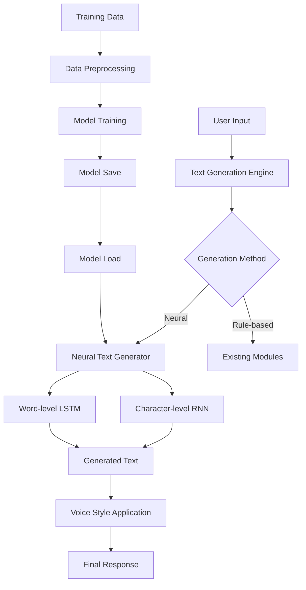

# Local Neural Text Generation Model Implementation

## Overview

Implement a local RNN/LSTM text generation model to enable Mavaia to generate natural text responses. The model will be trained on Project Gutenberg books and integrated as a new module that works alongside the existing text generation system.

## Architecture



## Implementation Plan

### 1. Create Neural Text Generator Module

**File**: `mavaia_core/brain/modules/neural_text_generator.py`

- New `BaseBrainModule` that implements both character-level and word-level models
- Operations:
  - `train_model`: Train from scratch or continue training
  - `generate_text`: Generate text from prompt
  - `generate_continuation`: Continue existing text
  - `load_model`: Load pre-trained model
  - `save_model`: Save trained model
  - `get_model_info`: Get model architecture and training info

### 2. Model Architecture

**Character-level RNN**:

- LSTM layers (2-3 layers, configurable)
- Hidden size: 256-512 (configurable)
- Embedding size: 128 (configurable)
- Dropout: 0.2-0.3

**Word-level LSTM**:

- LSTM layers (2-3 layers, configurable)
- Hidden size: 512-1024 (configurable)
- Embedding size: 256 (configurable)
- Vocabulary size: Dynamic based on training data
- Dropout: 0.2-0.3

### 3. Data Pipeline

**File**: `mavaia_core/brain/modules/neural_text_generator_data.py` (helper module)

- `load_gutenberg_data`: Download/load Project Gutenberg books
- `preprocess_text`: Clean and normalize text
- `create_character_sequences`: Create character-level training sequences
- `create_word_sequences`: Create word-level training sequences
- `build_vocabulary`: Build word-to-index mappings

### 4. Training Pipeline

**Training Configuration**:

- Batch size: 64-128 (configurable)
- Sequence length: 100-200 characters/words (configurable)
- Learning rate: 0.001-0.01 (configurable)
- Epochs: Configurable (default: 10-20)
- Optimizer: Adam
- Loss: Categorical crossentropy (character) / Sparse categorical crossentropy (word)

**Training Features**:

- Early stopping based on validation loss
- Model checkpointing
- Training progress logging
- Validation split (80/20)

### 5. Model Storage

**Storage Location**: `mavaia_core/models/neural_text_generator/`

- Model files: `char_model.h5` / `word_model.h5`
- Metadata: `char_model.json` / `word_model.json` (vocabulary, config, training history)
- Checkpoints: `checkpoints/char_model_epoch_{n}.h5`

### 6. Integration Points

**Integration with Text Generation Engine**:

- Modify `text_generation_engine.py` to optionally use neural model
- Add `use_neural_generation` parameter
- Fallback to rule-based if neural model unavailable

**Integration with Universal Voice Engine**:

- Pass `voice_context` to neural generator for style adaptation
- Use temperature sampling based on voice context

### 7. Dependencies

**Add to `requirements-ml.txt`**:

- `tensorflow>=2.13.0` OR `torch>=2.0.0` (user choice)
- `numpy>=1.23.0` (already present)
- `requests>=2.28.0` (for downloading Gutenberg data)

**Note**: The codebase currently uses JAX/Flax. We'll add TensorFlow/Keras as an optional dependency, with graceful fallback if not available.

### 8. Configuration

**File**: `mavaia_core/brain/modules/neural_text_generator_config.json`

```json
{
  "model_type": "both",
  "character_model": {
    "hidden_size": 256,
    "num_layers": 2,
    "embedding_size": 128,
    "dropout": 0.2
  },
  "word_model": {
    "hidden_size": 512,
    "num_layers": 2,
    "embedding_size": 256,
    "dropout": 0.2
  },
  "training": {
    "batch_size": 64,
    "sequence_length": 100,
    "learning_rate": 0.001,
    "epochs": 10,
    "validation_split": 0.2
  },
  "generation": {
    "temperature": 0.7,
    "max_length": 500,
    "top_k": 50,
    "top_p": 0.9
  }
}
```

### 9. Training Script

**File**: `scripts/train_neural_text_generator.py`

Standalone script for training:

- Download Project Gutenberg data
- Preprocess and prepare sequences
- Train both character and word models
- Save models and metadata
- Generate sample outputs

### 10. Testing

- Unit tests for data preprocessing
- Unit tests for model training (small dataset)
- Integration tests with text_generation_engine
- Test fallback behavior when model unavailable

## Implementation Details

### Character-level Model (TensorFlow/Keras)

```python
from tensorflow import keras
from tensorflow.keras import layers

def build_char_model(vocab_size, embedding_dim=128, hidden_size=256, num_layers=2):
    model = keras.Sequential([
        layers.Embedding(vocab_size, embedding_dim),
        *[layers.LSTM(hidden_size, return_sequences=True, dropout=0.2) 
          for _ in range(num_layers)],
        layers.Dense(vocab_size, activation='softmax')
    ])
    return model
```

### Word-level Model (TensorFlow/Keras)

```python
def build_word_model(vocab_size, embedding_dim=256, hidden_size=512, num_layers=2):
    model = keras.Sequential([
        layers.Embedding(vocab_size, embedding_dim),
        *[layers.LSTM(hidden_size, return_sequences=True, dropout=0.2) 
          for _ in range(num_layers)],
        layers.Dense(vocab_size, activation='softmax')
    ])
    return model
```

### Text Generation with Temperature Sampling

```python
def generate_text(model, prompt, max_length=500, temperature=0.7):
    # Convert prompt to sequence
    # Generate character/word by character/word
    # Apply temperature sampling for diversity
    # Return generated text
```

## Files to Create

1. `mavaia_core/brain/modules/neural_text_generator.py` - Main module
2. `mavaia_core/brain/modules/neural_text_generator_data.py` - Data loading/preprocessing
3. `mavaia_core/brain/modules/neural_text_generator_config.json` - Configuration
4. `scripts/train_neural_text_generator.py` - Training script
5. `mavaia_core/models/neural_text_generator/` - Model storage directory

## Files to Modify

1. `mavaia_core/brain/modules/text_generation_engine.py` - Add neural generation option
2. `requirements-ml.txt` - Add TensorFlow/Keras dependency
3. `mavaia_core/brain/modules/__init__.py` - Register new module

## Training Data

- Source: Project Gutenberg (download via `gutenberg` package or direct HTTP)
- Books: Mix of fiction and non-fiction for general language modeling
- Preprocessing: Lowercase, remove special formatting, split into sequences
- Size: Start with 1-3 books, scale up as needed

## Integration Strategy

1. **Phase 1**: Create module with training and inference
2. **Phase 2**: Integrate with text_generation_engine as optional enhancement
3. **Phase 3**: Add voice context adaptation
4. **Phase 4**: Fine-tune on Mavaia-specific responses (if data available)

## Error Handling

- Graceful fallback if TensorFlow/Keras not available
- Fallback to rule-based generation if model not trained
- Handle OOM errors with batch size reduction
- Validate model files before loading

## Performance Considerations

- Use GPU if available (automatic detection)
- Batch generation for efficiency
- Model quantization for smaller models
- Lazy loading of models (load on first use)

## Testing Strategy

1. Train on small dataset (single book, 1000 sequences)
2. Verify text generation produces coherent output
3. Test integration with text_generation_engine
4. Test fallback mechanisms
5. Performance benchmarks