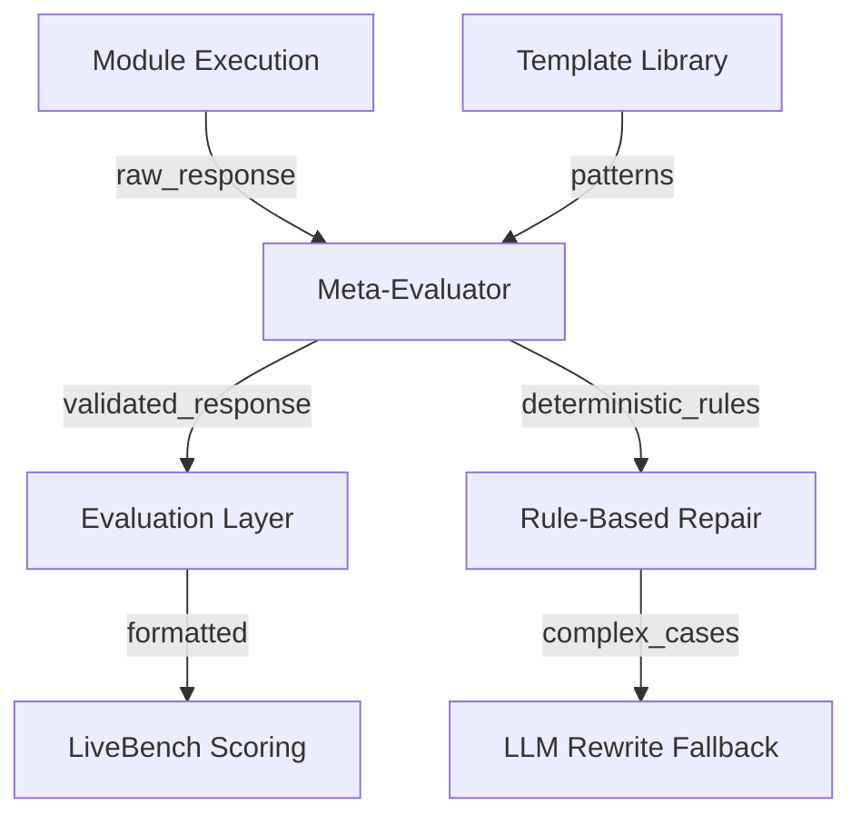

# Meta-Evaluator Implementation Plan

## Overview

Create a `MetaEvaluatorModule` that validates and repairs module outputs before they're scored. The evaluator will:

- Check outputs against task-specific templates
- Repair structural issues (unclosed tags, malformed JSON/XML)
- Align answer counts to question counts
- Remove apology/disclaimer language
- Regenerate missing elements
- Enforce deterministic formatting

## Architecture

The Meta-Evaluator will operate at two integration points:



## Implementation Steps

### 1. Create Meta-Evaluator Module

**File**: `oricli_core/brain/modules/meta_evaluator.py`

**Key Components**:

- **Template Library** (embedded): Task-specific templates for:
  - Zebra puzzles: `<solution>answer1, answer2, answer3, answer4, answer5</solution>`
  - Web of lies: `**yes, no, yes**` (exactly matching question count)
  - Spatial reasoning: Position coordinates `(x,y)` or entity lists
  - General reasoning: Structured answer formats

- **Operations**:
  - `evaluate_and_repair`: Main operation - full evaluation and repair pipeline
  - `check_structure`: Validates structural integrity (tags, brackets, quotes)
  - `repair_formatting`: Fixes formatting issues
  - `align_answers`: Ensures answer count matches question count
  - `remove_disclaimers`: Strips apology/uncertainty language
  - `close_tags`: Repairs unclosed XML/JSON tags
  - `regenerate_missing`: Fills in missing required elements

**Implementation Approach**:

1. **Deterministic Rules Engine**:

   - Regex-based pattern matching for common issues
   - Template-based repair using task type templates
   - String manipulation for structural fixes
   - Answer counting and alignment logic

2. **LLM Fallback** (hybrid approach):

   - Only when deterministic rules fail
   - Uses `cognitive_generator` module for intelligent rewriting
   - Focuses on semantic repair (regenerating missing answers, fixing garbled text)

3. **Template Matching**:

   - Detects task type from question metadata or text patterns
   - Applies appropriate template
   - Validates against expected format
   - Repairs deviations

### 2. Template Library Structure

Embedded in module as dictionaries mapping task types to:

- Expected format patterns (regex)
- Required structural elements
- Answer count rules (e.g., zebra puzzles = 5, web_of_lies = question count)
- Valid answer formats

**Key Templates**:

```python
TEMPLATES = {
    "zebra_puzzle": {
        "format": r"<solution>.*?</solution>",
        "answer_count": 5,
        "separator": ", ",
        "pattern": r"<solution>([^<]+)</solution>"
    },
    "web_of_lies": {
        "format": r"\*\*.*?\*\*",
        "answer_count": "dynamic",  # Match question count
        "separator": ", ",
        "valid_answers": ["yes", "no"],
        "pattern": r"\*\*((?:yes|no)(?:,\s*(?:yes|no))*)\*\*"
    },
    "spatial": {
        "format": r"\((\d+),(\d+)\)",  # Coordinates
        "answer_count": "dynamic",
        "alternatives": ["entity lists", "coordinates"]
    }
}
```

### 3. Integration Point 1: Module-Level

**File**: `oricli_core/brain/modules/custom_reasoning_networks.py`

**Changes**:

- Add lazy loading of meta_evaluator module
- Call `evaluate_and_repair` before returning responses in:
  - `_multi_step_reasoning` (after generating response)
  - `_solve_zebra_puzzle` (before returning)
  - `_solve_spatial_problem` (before returning)
  - Puzzle solver paths (web_of_lies, etc.)

**Integration Pattern**:

```python
# Before returning response
if self._meta_evaluator is None:
    self._meta_evaluator = self._module_registry.get_module("meta_evaluator")
    
if self._meta_evaluator:
    result = self._meta_evaluator.execute("evaluate_and_repair", {
        "response": response_text,
        "question_text": original_text,
        "task_type": detected_task_type,
        "question_count": question_count
    })
    response_text = result.get("repaired_response", response_text)
```

### 4. Integration Point 2: Evaluation Layer

**File**: `oricli_core/evaluation/categories/livebench_tests.py`

**Changes**:

- Modify `_extract_module_response` to call meta-evaluator after extraction
- Modify `_format_response_for_livebench` to apply meta-evaluator repair
- Pass question metadata (task type, question count) to evaluator

**Integration Pattern**:

```python
# In run_test_case method, after extracting response
response_text = self._extract_module_response(module_result, question)

# Apply meta-evaluator
meta_evaluator = self.registry.get_module("meta_evaluator")
if meta_evaluator:
    task_type = question.get("task", "")
    question_count = question_text.count("?") or len(question.get("turns", []))
    
    result = meta_evaluator.execute("evaluate_and_repair", {
        "response": response_text,
        "question_text": question_text,
        "task_type": task_type,
        "question_count": question_count,
        "question_metadata": question
    })
    response_text = result.get("repaired_response", response_text)
```

### 5. Core Repair Functions

**Structural Repair**:

- Detect unclosed tags: `<solution>` without `</solution>`
- Detect unclosed brackets: [without](without), `{` without `}`
- Repair nested structures: JSON arrays, XML tags
- Ensure quote matching

**Format Repair**:

- Strip leading/trailing whitespace
- Normalize separators (standardize comma spacing)
- Fix capitalization (for entity names)
- Remove duplicate separators

**Answer Alignment**:

- Count questions in original text
- Count answers in response
- Generate missing answers using template defaults
- Remove excess answers if over count

**Disclaimer Removal**:

- Pattern match and remove phrases like:
  - "I apologize", "I'm sorry", "I cannot"
  - "I'm not sure", "I don't know", "I'm uncertain"
  - "This may be wrong", "I might be incorrect"
- Preserve legitimate uncertainty if it's part of the answer

**Tag Closure**:

- Detect incomplete XML tags: `<solution>text` → `<solution>text</solution>`
- Detect incomplete JSON: `{"key": "value` → `{"key": "value"}`
- Repair nested structures recursively

**Missing Element Regeneration**:

- If template requires N answers but only M provided (M < N):
  - Generate default answers based on task type
  - Use entity extraction from question text
  - Apply template-specific defaults

### 6. LLM Fallback Integration

When deterministic rules can't repair:

- Use `cognitive_generator` module to rewrite response
- Provide context: original question, task type, expected format
- Request specific repairs: "Fix JSON structure", "Generate missing answers"
- Parse and validate LLM output before returning

### 7. Testing and Validation

- Unit tests for each repair function
- Integration tests with actual LiveBench questions
- Validation that repaired responses maintain semantic meaning
- Performance testing (meta-evaluator should be fast, <100ms)

## Files to Create

1. `oricli_core/brain/modules/meta_evaluator.py` - Main module (~800-1000 lines)

## Files to Modify

1. `oricli_core/brain/modules/custom_reasoning_networks.py`

   - Add meta_evaluator integration in response generation methods
   - ~5-10 integration points

2. `oricli_core/evaluation/categories/livebench_tests.py`

   - Add meta_evaluator call in `run_test_case`
   - Modify `_extract_module_response` to include repair step
   - ~20-30 lines of changes

## Success Criteria

- All responses have correct structural format (tags closed, brackets matched)
- Answer counts always match question counts
- No apology/disclaimer language in final responses
- Deterministic formatting across all task types
- <100ms average processing time
- Integration doesn't break existing functionality