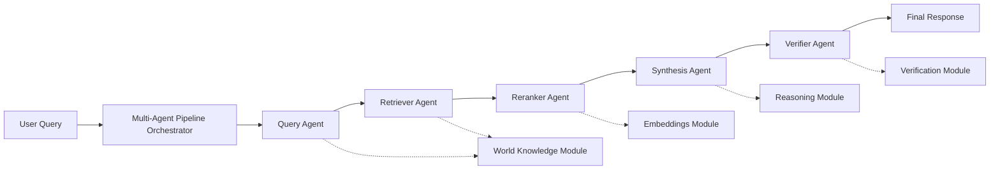

# Perplexity Multi-Agent Pipeline Implementation Plan

## Overview

Implement Perplexity's Multi-Agent Pipeline as a production-quality system within Mavaia's cognitive architecture. The pipeline consists of five specialized agents coordinated by a central orchestrator, following Mavaia's BaseBrainModule pattern.

## Architecture



## Implementation Components

### 1. Query Agent Module (`query_agent.py`)

**Location**: `mavaia_core/brain/modules/query_agent.py`

**Purpose**: Normalize user input, extract keywords, and formulate precise search queries.

**Operations**:

- `normalize_query`: Clean and normalize user input
- `extract_keywords`: Extract relevant keywords and entities
- `formulate_search_queries`: Generate multiple search query variations
- `analyze_query_intent`: Determine query type and complexity

**Integration**:

- Leverages `query_complexity.py` for complexity analysis
- Uses `intent_categorizer.py` for intent detection
- Integrates with `world_knowledge.py` for entity extraction

### 2. Retriever Agent Module (`retriever_agent.py`)

**Location**: `mavaia_core/brain/modules/retriever_agent.py`

**Purpose**: Fetch candidate documents from various sources.

**Operations**:

- `retrieve_documents`: Fetch documents from knowledge base
- `retrieve_from_sources`: Multi-source retrieval (knowledge base, memory, external)
- `expand_query`: Query expansion for better retrieval
- `filter_candidates`: Initial filtering of retrieved documents

**Integration**:

- Enhances `world_knowledge.py` retrieval capabilities
- Uses `memory_graph.py` for memory-based retrieval
- Integrates with `document_orchestration.py` for document handling

### 3. Reranker Agent Module (`reranker_agent.py`)

**Location**: `mavaia_core/brain/modules/reranker_agent.py`

**Purpose**: Score and rank retrieved documents by relevance.

**Operations**:

- `rerank_documents`: Score documents using multiple signals
- `calculate_relevance`: Multi-factor relevance scoring
- `select_top_k`: Select top-k most relevant documents
- `diversify_results`: Ensure result diversity

**Integration**:

- Uses `embeddings.py` for semantic similarity
- Leverages `phrase_embeddings.py` ranking capabilities
- Integrates with `world_knowledge.py` for domain-specific ranking

### 4. Synthesis Agent Module (`synthesis_agent.py`)

**Location**: `mavaia_core/brain/modules/synthesis_agent.py`

**Purpose**: Compile coherent answers from top-ranked documents.

**Operations**:

- `synthesize_answer`: Combine information from multiple sources
- `generate_response`: Generate natural language response
- `merge_information`: Intelligently merge information from documents
- `handle_conflicts`: Resolve conflicting information

**Integration**:

- Uses `cognitive_generator.py` for response generation
- Leverages `reasoning.py` for logical synthesis
- Integrates with `natural_language_flow.py` for natural responses

### 5. Verifier Agent Module (`verifier_agent.py`)

**Location**: `mavaia_core/brain/modules/verifier_agent.py`

**Purpose**: Fact-check and validate synthesized information.

**Operations**:

- `verify_facts`: Validate facts against knowledge base
- `check_citations`: Verify citation accuracy
- `validate_consistency`: Check internal consistency
- `assess_confidence`: Calculate confidence scores

**Integration**:

- Enhances `verification.py` with fact-checking
- Uses `world_knowledge.py` for fact validation
- Integrates with `evidence_evaluation.py` for evidence assessment

### 6. Multi-Agent Pipeline Orchestrator (`multi_agent_pipeline.py`)

**Location**: `mavaia_core/brain/modules/multi_agent_pipeline.py`

**Purpose**: Coordinate all agents in the pipeline.

**Operations**:

- `process_query`: Main entry point for query processing
- `execute_pipeline`: Execute full pipeline workflow
- `handle_feedback`: Process verification feedback and iterate
- `optimize_pipeline`: Dynamic pipeline optimization

**Features**:

- Sequential agent execution with context passing
- Error handling and fallback mechanisms
- Performance monitoring and metrics
- Configurable pipeline stages

## File Structure

```
mavaia_core/brain/modules/
├── query_agent.py              # NEW: Query normalization and keyword extraction
├── retriever_agent.py          # NEW: Document retrieval from multiple sources
├── reranker_agent.py           # NEW: Document relevance ranking
├── synthesis_agent.py          # NEW: Answer synthesis from documents
├── verifier_agent.py           # NEW: Fact verification and validation
├── multi_agent_pipeline.py     # NEW: Pipeline orchestrator
└── [existing modules...]
```

## Implementation Details

### Query Agent

- Input validation and normalization
- Keyword extraction using NLP techniques
- Query expansion with synonyms and related terms
- Intent classification integration

### Retriever Agent

- Multi-source retrieval (knowledge base, memory, external APIs)
- Query expansion for better recall
- Initial relevance filtering
- Document metadata extraction

### Reranker Agent

- Multi-factor scoring (semantic similarity, keyword match, recency, authority)
- Cross-encoder reranking (if models available)
- Diversity optimization
- Top-k selection with configurable thresholds

### Synthesis Agent

- Information extraction from ranked documents
- Conflict resolution strategies
- Coherent answer generation
- Citation tracking

### Verifier Agent

- Fact-checking against knowledge base
- Citation validation
- Consistency checking
- Confidence scoring

### Pipeline Orchestrator

- Agent coordination with proper sequencing
- Context passing between agents
- Error recovery and retry logic
- Performance optimization
- Metrics collection

## Integration Points

1. **Existing Modules to Leverage**:

   - `world_knowledge.py`: Knowledge retrieval
   - `query_complexity.py`: Query analysis
   - `embeddings.py`: Semantic similarity
   - `verification.py`: Basic verification (enhance)
   - `document_orchestration.py`: Document handling
   - `unified_interface.py`: Request routing

2. **Module Registry Integration**:

   - All agents register as BaseBrainModule instances
   - Auto-discovery via ModuleRegistry
   - Standardized operation interface

3. **Orchestrator Integration**:

   - Uses ModuleOrchestrator for agent coordination
   - Integrates with ModuleLifecycle for state management
   - Leverages DependencyGraph for execution order

## Error Handling

- Comprehensive error handling at each agent level
- Fallback mechanisms for agent failures
- Graceful degradation when agents unavailable
- Detailed error reporting and logging

## Testing Strategy

- Unit tests for each agent module
- Integration tests for pipeline workflow
- End-to-end tests with sample queries
- Performance benchmarks

## Production Considerations

- Full type hints and docstrings
- Comprehensive parameter validation
- Edge case handling
- Performance optimization
- Memory efficiency
- Thread safety (if needed)

## Configuration

- Pipeline configuration via JSON config files
- Agent-specific parameters
- Thresholds and limits
- Feature flags for optional capabilities

## Documentation

- Complete docstrings for all classes and methods
- Architecture documentation
- Usage examples
- Integration guide