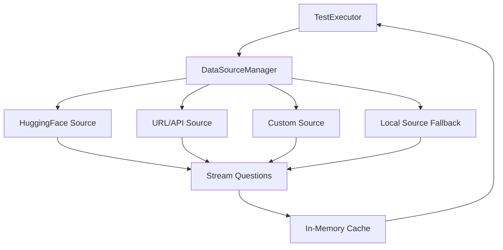

# Remote Data Source Integration for Curriculum Testing

## Overview

Transform the curriculum testing framework from local file-based data loading to a remote data source system that streams test questions directly from URLs, HuggingFace datasets, and APIs without downloading to disk. This eliminates the need for 30GB+ of local storage while maintaining full automation.

## Architecture

### Data Flow




### Components

1. **DataSource Abstraction Layer** (`oricli_core/evaluation/curriculum/data_sources/`)

- Base interface for all data sources
- Unified streaming API
- Automatic source selection

2. **Remote Data Sources**

- HuggingFace datasets (MMLU, GSM8K, MATH, etc.)
- Direct URL/API sources
- Custom sources via configuration

3. **DataSource Manager**

- Auto-discovery of known datasets
- Source registry and selection
- Streaming and filtering

4. **Modified Executor**

- Replace `_load_question()` with data source calls
- Stream questions on-demand
- No local file dependencies

## Implementation Details

### 1. Data Source Abstraction (`data_sources/base.py`)

Create base interface similar to `neural_text_generator_data.py`:

```python
class BaseDataSource(ABC):
    """Base class for curriculum test data sources"""
    
    @abstractmethod
    def stream_questions(
        self,
        level: str,
        subject: str,
        skill_type: Optional[str] = None,
        difficulty_style: Optional[str] = None,
        limit: Optional[int] = None
    ) -> Iterator[Dict[str, Any]]:
        """Stream questions matching criteria"""
        pass
    
    @abstractmethod
    def get_source_name(self) -> str:
        """Return source identifier"""
        pass
    
    @abstractmethod
    def supports_filtering(self) -> bool:
        """Whether source supports filtering by criteria"""
        pass
```


### 2. HuggingFace Data Source (`data_sources/huggingface_source.py`)

Implement streaming from HuggingFace datasets:

- **Known Educational Datasets**:
- `hendrycks/MMLU` - Multi-task language understanding
- `gsm8k` - Grade school math problems
- `hendrycks/MATH` - Competition math problems
- `lighteval/mmlu` - MMLU variants
- `openai/grade-school-math` - Elementary math
- `allenai/ai2_arc` - Science questions
- `allenai/commonsense_qa` - Common sense reasoning
- **Features**:
- Stream datasets without downloading
- Map dataset fields to curriculum format
- Filter by level/subject automatically
- Support custom dataset paths

### 3. URL/API Data Source (`data_sources/url_source.py`)

Support direct URLs and APIs:

- HTTP/HTTPS JSON endpoints
- REST APIs with pagination
- Streaming JSON parsers
- Authentication support (API keys, tokens)

### 4. Custom Source (`data_sources/custom_source.py`)

Allow users to add custom sources via configuration:

- YAML/JSON configuration file
- Plugin-style source registration
- Custom field mappings

### 5. Data Source Manager (`data_sources/manager.py`)

Central registry and orchestration:

- Auto-discover known datasets
- Source priority and fallback
- Question filtering and transformation
- In-memory caching (optional, disabled by default)

### 6. Configuration System (`data_sources/config.py`)

Source configuration:

- Default sources (auto-discovered)
- Custom source definitions
- Field mappings
- Filtering rules

### 7. Modified Executor (`executor.py`)

Update `TestExecutor`:

- Replace `self.data_dir` with `DataSourceManager`
- Modify `_load_question()` to use data sources
- Update `_execute_all_tests()` to stream from sources
- Remove local file dependencies

### 8. CLI Updates (`cli.py`)

Add data source management:

- `--source` option to specify data source
- `--list-sources` to show available sources
- `--add-source` to register custom sources

## File Structure

```javascript
oricli_core/evaluation/curriculum/
├── data_sources/
│   ├── __init__.py
│   ├── base.py              # BaseDataSource abstract class
│   ├── manager.py            # DataSourceManager
│   ├── huggingface_source.py # HuggingFace datasets
│   ├── url_source.py         # URL/API sources
│   ├── custom_source.py      # Custom sources
│   ├── local_source.py       # Local file fallback
│   └── config.py             # Source configuration
├── executor.py               # Modified to use data sources
├── cli.py                     # Updated with source options
└── data/                      # Keep for metadata only
    └── metadata/             # Level/subject metadata
```


## Key Features

1. **Zero Disk Usage**: Stream all data, no downloads
2. **Auto-Discovery**: Automatically find and use known educational datasets
3. **Custom Sources**: Add your own URLs/APIs via configuration
4. **Backward Compatible**: Fallback to local files if needed
5. **Streaming**: Process questions as they arrive
6. **Filtering**: Filter by level/subject/skill/difficulty at source
7. **No Caching**: Always fetch fresh data (per user preference)

## Implementation Steps

1. Create data source abstraction layer (`base.py`)
2. Implement HuggingFace source with known datasets (`huggingface_source.py`)
3. Implement URL/API source (`url_source.py`)
4. Create data source manager with auto-discovery (`manager.py`)
5. Implement configuration system (`config.py`)
6. Add local source fallback (`local_source.py`)
7. Modify executor to use data sources (`executor.py`)
8. Update CLI with source management (`cli.py`)
9. Add tests and documentation

## Dependencies

- `datasets` (HuggingFace) - for streaming datasets
- `huggingface_hub` - for dataset access
- `requests` - for URL/API access
- `smart_open` (optional) - for efficient URL streaming
- `pyyaml` - for configuration files

## Configuration Example

```yaml
# curriculum_sources.yaml
sources:
    - type: huggingface
    dataset: "hendrycks/MMLU"
    name: "MMLU"
    auto_discover: true
    
    - type: huggingface
    dataset: "gsm8k"
    name: "GSM8K"
    auto_discover: true
    
    - type: url
    url: "https://api.example.com/questions"
    name: "Custom API"
    auth:
      type: "bearer"
      token_env: "CUSTOM_API_TOKEN"
    field_mapping:
      question: "text"
      answer: "solution"
      level: "grade_level"
      
    - type: local
    path: "data/levels"
    name: "Local Files"
    fallback_only: true
```


## Benefits

- **No Disk Usage**: Eliminates 30GB+ storage requirements
- **Always Fresh**: No stale cached data
- **Extensible**: Easy to add new sources
- **Automated**: Auto-discovers known datasets
- **Flexible**: Supports any URL/API source

## Field Mapping

Each source needs to map its native format to the curriculum format:

```python
{
    "id": str,
    "question": str,
    "answer": str,
    "level": str,
    "subject": str,
    "skill_type": str,
    "difficulty_style": str,
    "question_type": str,
    "metadata": {
        "estimated_time": float,
        "estimated_tokens": int,
        "expected_reasoning_steps": int
    }
}

```