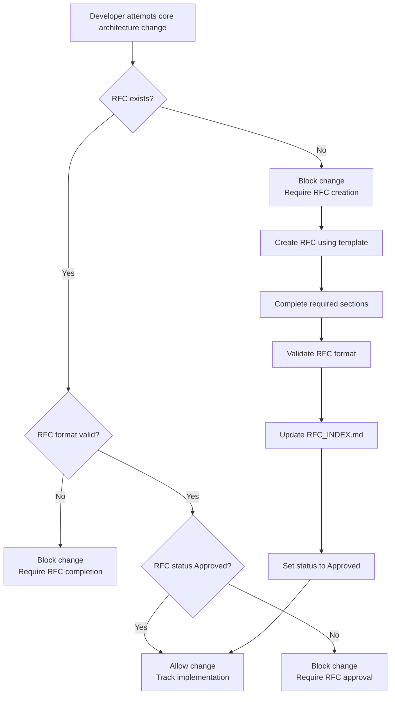

# Thynaptic RFC System Implementation

## Overview

Create an automated RFC system that enforces RFC filing before core architecture changes. The system will be fully automated through Cursor rules, requiring RFCs in `.cursor/rules/governance/RFC/` before allowing changes to core architecture files.

## Core Architecture Definition

Core architecture files that require RFCs:

**Brain System Core:**

- `oricli_core/brain/base_module.py` - BaseBrainModule interface
- `oricli_core/brain/registry.py` - ModuleRegistry
- `oricli_core/brain/orchestrator.py` - ModuleOrchestrator
- `oricli_core/brain/state_storage/base_storage.py` - BaseStorage interface
- `oricli_core/brain/dependency_graph.py` - Dependency management
- `oricli_core/brain/module_lifecycle.py` - Lifecycle management

**API & Client Core:**

- `oricli_core/api/server.py` - FastAPI server structure
- `oricli_core/api/openai_compatible.py` - OpenAI compatibility layer
- `oricli_core/client.py` - MavaiaClient interface

**Architecture Rules:**

- `.cursor/rules/engineering/architecture_rules.mdc` - Architecture governance

**Pattern-Based Detection:**

- Changes to abstract base classes (ABC)
- Changes to public interfaces/APIs
- Changes to module discovery mechanisms
- Changes to orchestration patterns

## Implementation Steps

### 1. Create RFC Directory Structure

- Create `.cursor/rules/governance/RFC/` directory
- Create `RFC_TEMPLATE.md` template file
- Create `RFC_INDEX.md` for tracking RFCs

### 2. Create RFC Template

Create standardized RFC template with required sections:

- RFC number and title
- Status (Draft, Approved, Implemented, Rejected)
- Author and date
- Summary
- Motivation
- Proposed Changes
- Impact Analysis
- Alternatives Considered
- Implementation Plan
- Approval Checklist

### 3. Create RFC Enforcement Rule

Create `.cursor/rules/governance/rfc_enforcement.mdc` that:

- Detects changes to core architecture files
- Checks for corresponding RFC file existence
- Validates RFC format and completeness
- Blocks changes if RFC is missing or invalid
- Provides clear error messages with RFC creation instructions

### 4. Create RFC Validation Rule

Create validation that ensures RFCs:

- Follow the template format
- Have all required sections completed
- Include proper RFC numbering
- Are linked in RFC_INDEX.md
- Have status tracking

### 5. Create RFC Approval Automation

Implement automated approval logic:

- RFCs with complete required sections are auto-approved
- Validation checklist must pass
- RFC status must be "Approved" before changes allowed
- Track RFC implementation status

## Files to Create

1. `.cursor/rules/governance/RFC/RFC_TEMPLATE.md` - RFC template
2. `.cursor/rules/governance/RFC/RFC_INDEX.md` - RFC registry
3. `.cursor/rules/governance/rfc_enforcement.mdc` - Enforcement rules
4. `.cursor/rules/governance/rfc_validation.mdc` - Validation rules

## RFC Workflow

## RFC Template Structure

The RFC template will include:

- RFC metadata (number, title, status, dates)
- Required sections with validation criteria
- Approval checklist
- Implementation tracking
- Cross-references to related RFCs

## Enforcement Mechanism

The enforcement rule will:

- Use file path globs to detect core architecture files
- Check for RFC file existence before allowing edits
- Validate RFC completeness using pattern matching
- Provide actionable error messages
- Support RFC creation workflow

## Validation Criteria

RFCs must have:

- Valid RFC number (RFC-YYYY-NNN format)
- All required sections completed (non-empty)
- Proper status field
- Entry in RFC_INDEX.md
- Approval checklist completed

## Integration with Existing Rules

- Integrate with `architecture_rules.mdc` 
- Reference in `code_review.mdc` for PR requirements
- Link to `department_standards.mdc` for governance